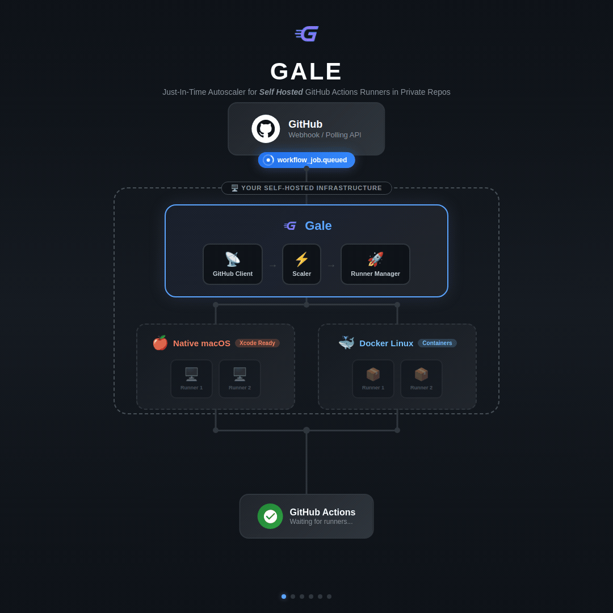
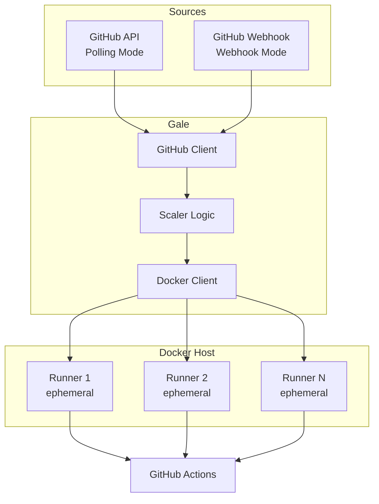

<p align="center">
  
</p>

<h1 align="center">Gale</h1>

<p align="center">
  <strong>Just-In-Time Autoscaler for GitHub Actions Self-Hosted Runners</strong><br>
  <em>(For private repositories)</em>
</p>

<p align="center">
  <a href="#tldr">TL;DR</a> •
  <a href="#features">Features</a> •
  <a href="#installation">Installation</a> •
  <a href="#getting-started">Getting Started</a> •
  <a href="#how-it-works">How It Works</a> •
  <a href="#documentation">Docs</a> •
  <a href="#cicd-gotchas-for-self-hosted-runners">Gotchas</a>
</p>

<p align="center">
  
</p>

---

> **AI-Generated Code Disclaimer**
>
> This codebase is generated almost entirely using [Claude Code](https://claude.com/code) with Claude Opus 4.5 and Haiku 4.5. The code is largely unreviewed but features are continuously tested by the maintainer ([@manashmandal](https://github.com/manashmandal)). Use at your own discretion.

---

## TL;DR

```bash
# Install via Homebrew (macOS/Linux)
brew install manashmandal/tap/gale

# Or build from source
git clone https://github.com/manashmandal/gale.git && cd gale
go build -o bin/gale ./cmd/gale

# Setup (interactive)
gale init

# Run (pick one)
gale start                    # Polling mode
gale webhook                  # Webhook mode (local)
gale webhook --funnel         # Webhook + Tailscale Funnel (zero-config HTTPS)
```

Then use `runs-on: gale` in your workflows. Done.

---

## Why Gale?

> _"I have a perfectly good machine sitting idle. Why am I waiting 15 minutes for a GitHub-hosted runner to npm install?"_

Sound familiar? You want self-hosted runners, but:

- **Kubernetes?** You just want to run some tests, not become a CNCF certified architect
- **Argo Workflows?** Cool, but you'll spend more time on YAML than actual code
- **Actions Runner Controller?** Hope you enjoy debugging Helm charts at 2 AM
- **Always-on runners?** Your electricity bill called, it's concerned

**Gale is for the rest of us.** One binary. Docker. That mass of compute power under your desk finally doing something useful.

### Real-World Benefits

- **Private repo runner quota exhausted?** GitHub gives limited free minutes for private repos. Gale lets you run unlimited jobs on your own hardware.

- **Faster builds on modest hardware.** A 2019 Dell XPS 15 7590 with 64GB RAM and a 1Gbps internet connection runs workflows in ~1 minute that take 3-5 minutes on GitHub-hosted runners. Your old laptop can outperform the cloud.

- **Future-proof your CI/CD.** [GitHub Actions pricing is changing](https://github.blog/changelog/2025-12-16-coming-soon-simpler-pricing-and-a-better-experience-for-github-actions/) — long-running builds on private repos will burn through your quota faster. Self-hosted runners give you predictable costs and unlimited minutes.

---

## When NOT to Use Gale

Gale is intentionally simple. It's not the right tool if:

- **You're using public repositories.** GitHub provides unlimited free minutes for public repos. Just use GitHub-hosted runners.

- **You already have Kubernetes with Argo Workflows / Tekton / etc.** If your CI/CD already offloads work to pods across a cluster, you have better orchestration than Gale provides. Consider [Actions Runner Controller](https://github.com/actions/actions-runner-controller) instead.

- **You need multi-machine orchestration.** Gale runs on a single Docker host. If you need runners coordinated across multiple machines with load balancing and failover, look at ARC or commercial solutions.

- **You need Windows runners.** Gale supports Linux and macOS (via native mode), but not Windows yet.

- **macOS with Docker mode.** Docker on macOS runs containers inside a Linux VM, so Docker mode cannot run macOS-native code. Use `runner.mode: native` for true macOS runners (Xcode, iOS builds, etc.). Note: Native mode on macOS is less battle-tested than Docker mode — it works, but may have edge cases.

- **You need enterprise-grade HA.** Gale is a single binary with no clustering support. If the host goes down, your runners go with it.

### Important Notes

| Topic                 | Note                                                                                                                                                                            |
| --------------------- | ------------------------------------------------------------------------------------------------------------------------------------------------------------------------------- |
| **Token Permissions** | GitHub App needs `Administration: Read & Write` permission to register runners. PATs need `repo` and `admin:org` scopes.                                                        |
| **Docker Socket**     | Runners get Docker socket access for DinD workflows. This is a security tradeoff — only run on trusted/dedicated hosts.                                                         |
| **Ephemeral Only**    | Runners are ephemeral (one job, then exit). No persistent runner state between jobs.                                                                                            |
| **Single Host**       | One Gale instance = one Docker host. No built-in distribution across machines.                                                                                                  |
| **Private Repos**     | Designed for private repos where runner minutes are limited. Public repos don't need this.                                                                                      |
| **Docker vs Native**  | Docker mode (`runner.mode: docker`) is more reliable and battle-tested. Native mode works but has platform-specific quirks, especially on macOS. Use Docker mode when possible. |

---

## Features

- **JIT Scaling** — Runners spawn only when jobs are queued, saving resources
- **Webhook Mode** — Event-driven scaling via GitHub webhooks (recommended)
- **Tailscale Funnel** — Zero-config public HTTPS endpoint for webhooks
- **Multi-Repo Support** — Monitor all repos in an org or select specific ones
- **Ephemeral Runners** — Runners automatically exit after completing a job
- **Auto Cleanup** — Exited containers are automatically removed
- **GitHub App Support** — Better security with auto-rotating tokens
- **Daemon Mode** — Run in background with `gale start --daemon`

---

## Installation

### Homebrew (macOS/Linux)

```bash
# Set GitHub token for private repo access
export HOMEBREW_GITHUB_API_TOKEN="ghp_your_token"

brew install manashmandal/tap/gale
```

See [Homebrew docs](docs/homebrew.md) for details on private repo distribution.

### From Source

```bash
git clone https://github.com/manashmandal/gale.git
cd gale
go build -o bin/gale ./cmd/gale
```

### Requirements

- Go 1.25+
- Docker
- GitHub Personal Access Token with `repo` scope (or GitHub App)

---

## Getting Started

### 1. Run Interactive Setup

```bash
./bin/gale init
```

### 2. Start Gale

**Option A: Polling Mode**

```bash
./bin/gale start
```

**Option B: Webhook Mode (Recommended)**

```bash
./bin/gale webhook --funnel
```

> **💡 Runner Mode:** By default, Gale uses Docker mode (`runner.mode: docker`) which is the most reliable option. Only use native mode (`runner.mode: native`) if you need macOS-specific features like Xcode or iOS builds.

### 3. Use in Your Workflow

```yaml
# .github/workflows/build.yml
name: Build
on: [push]

jobs:
  build:
    runs-on: gale # or [self-hosted, gale]
    steps:
      - uses: actions/checkout@v4
      - run: echo "Hello from Gale!"
```

That's it! Gale will automatically spawn a runner when the job is queued.

---

## How It Works



1. **Detect** — Gale receives job events (webhook) or polls GitHub API
2. **Filter** — Only jobs matching configured labels are processed
3. **Scale** — Spawns new runners for queued jobs (up to max_runners)
4. **Execute** — Runners pick up jobs and execute them
5. **Cleanup** — Ephemeral runners exit after one job, containers are removed

---

## Documentation

| Document                                     | Description                                     |
| -------------------------------------------- | ----------------------------------------------- |
| [Configuration](docs/configuration.md)       | Config file reference and environment variables |
| [CLI Reference](docs/cli-reference.md)       | Complete command reference                      |
| [Webhook Mode](docs/webhook-mode.md)         | Setting up event-driven scaling                 |
| [Tailscale Funnel](docs/tailscale-funnel.md) | Zero-config public HTTPS endpoint               |
| [GitHub App](docs/github-app.md)             | Using GitHub App authentication                 |
| [Deployment](docs/deployment.md)             | Systemd, Docker, and Kamal deployment           |
| [Homebrew](docs/homebrew.md)                 | Installing via Homebrew (private repo setup)    |
| [Examples](docs/examples.md)                 | Usage patterns and workflow examples            |

---

## Quick Reference

```bash
# Status and monitoring
gale status                  # Show status, runners, queued jobs
gale runners list            # List running containers

# Configuration
gale config show             # Display current config
gale config set KEY VALUE    # Set a config value

# Repository management
gale repo add <repo>         # Add a repo to monitor
gale repo list               # List monitored repos

# Warm pool
gale pool 3                  # Keep 3 runners pre-started
gale pool 0                  # Scale to zero when idle
```

See [CLI Reference](docs/cli-reference.md) for all commands.

---

## Security Considerations

### Docker Socket Access

Gale mounts the Docker socket (`/var/run/docker.sock`) into runner containers to support Docker-in-Docker workflows. **This grants containers effective root access to the host system.**

**Risks:**

- Code running in workflows can escape the container
- Malicious workflows could access host filesystem or spawn privileged containers

**Mitigations:**

- Only run Gale on dedicated runner hosts, not on production machines
- Use private repositories or trusted contributors only
- Consider using a Docker socket proxy (e.g., [Tecnativa/docker-socket-proxy](https://github.com/Tecnativa/docker-socket-proxy)) to restrict API access
- Enable webhook signature verification in production

### Webhook Security

Always configure a webhook secret in production:

```yaml
webhook:
  secret: "your-secure-random-secret"
```

Or use the `--require-signature` flag:

```bash
gale webhook --require-signature
```

Without signature verification, anyone can send forged webhook events to trigger runner creation.

### Token Security

- Use environment variables for tokens: `token: ${GITHUB_TOKEN}`
- Consider using GitHub App authentication instead of PATs for auto-rotating tokens
- Never commit tokens to version control

---

## CI/CD Gotchas for Self-Hosted Runners

When using Gale with GitHub Actions on self-hosted runners, be aware of these common issues:

### Go Cache Hangs

The `actions/setup-go` action's built-in caching can hang indefinitely on self-hosted runners when uploading cache to GitHub's cache service.

**Fix:** Disable caching in your workflow:

```yaml
- name: Setup Go
  uses: actions/setup-go@v5
  with:
    go-version: "1.23"
    cache: false # Disable cache to prevent hangs
```

### Missing CLI Tools

Self-hosted runners may lack common tools that GitHub-hosted runners include (e.g., `bc`, `jq`, `tree`).

**Fix:** Either install missing tools on your runner image, or use portable alternatives:

```yaml
# Instead of bc for comparisons
- run: |
    # Bad: bc may not exist
    if [ "$(echo "$VALUE < 70" | bc)" -eq 1 ]; then ...

    # Good: use awk instead
    if awk "BEGIN {exit !($VALUE < 70)}"; then ...
```

### Cache Contention

Parallel jobs may fail with "Unable to reserve cache with key..." when multiple jobs try to save the same cache simultaneously.

**Fix:** Use unique cache keys per job, or disable caching entirely for parallel workflows.

### Toolchain Auto-Download

If your `go.mod` specifies a Go version newer than what's installed, Go will attempt to auto-download it via `GOTOOLCHAIN=auto`. This can cause unexpected behavior.

**Fix:** Ensure your CI Go version matches or exceeds the `go.mod` requirement:

```yaml
- uses: actions/setup-go@v5
  with:
    go-version: "1.23" # Should match go.mod
```

---

## License

MIT License

## Contributing

Contributions are welcome! Please open an issue or submit a pull request.
