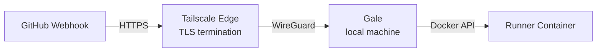

# Tailscale Funnel

[Tailscale Funnel](https://tailscale.com/kb/1223/funnel/) allows you to expose your local Gale webhook server to the public internet without any infrastructure setup.

## Benefits

| Feature | Traditional Setup | Tailscale Funnel |
|---------|-------------------|------------------|
| Public IP | Required | Not needed |
| Port forwarding | Manual config | Automatic |
| TLS certificates | Let's Encrypt/manual | Automatic |
| DNS | Required | Automatic (`*.ts.net`) |
| Firewall | Open ports | No changes |
| Setup time | Hours | Minutes |

## How It Works



1. GitHub sends webhook to your public Funnel URL
2. Tailscale receives the request at their edge servers
3. Request is encrypted and forwarded to your machine via WireGuard
4. Gale receives the webhook and spawns a runner

## Prerequisites

1. [Tailscale](https://tailscale.com/download) installed (doesn't need to be running - Gale uses embedded tsnet)

2. Funnel enabled in your Tailscale ACL policy. Go to [Tailscale Admin Console](https://login.tailscale.com/admin/acls) and add:
   ```json
   "nodeAttrs": [
     {
       "target": ["*"],
       "attr": ["funnel"]
     }
   ]
   ```

## Usage

### Basic Usage

```bash
gale webhook --funnel
```

On first run, you'll be prompted to authenticate with Tailscale. Gale will display your public webhook URL:

```
┌─────────────────────────────────────────────────────────────┐
│  Gale Webhook Server (Tailscale Funnel)                     │
├─────────────────────────────────────────────────────────────┤
│  Webhook URL: https://gale-hostname.tailnet.ts.net/webhook  │
└─────────────────────────────────────────────────────────────┘
```

### Custom Hostname

The default hostname is `gale-<machine-hostname>`. Override with:

```bash
gale webhook --funnel --hostname my-custom-name
```

This creates: `https://my-custom-name.tailnet.ts.net/webhook`

### Daemon Mode

Run in background:

```bash
gale webhook --funnel --daemon
```

## GitHub Configuration

1. Copy the webhook URL displayed by Gale

2. Go to GitHub repo/org → Settings → Webhooks → Add webhook

3. Configure:
   - **Payload URL**: `https://gale-hostname.tailnet.ts.net/webhook`
   - **Content type**: `application/json`
   - **Secret**: Your webhook secret (recommended)
   - **Events**: Select "Workflow jobs"

4. Save and verify the delivery succeeds

## Troubleshooting

### "Funnel not enabled"

Add the funnel attribute to your Tailscale ACL policy (see Prerequisites).

### Authentication Issues

Delete the Tailscale state and re-authenticate:

```bash
rm -rf ~/.config/gale/tsnet-*
gale webhook --funnel
```

### Connection Issues

Check Tailscale status:

```bash
tailscale status
```

Verify your machine appears in the [Tailscale Admin Console](https://login.tailscale.com/admin/machines).
